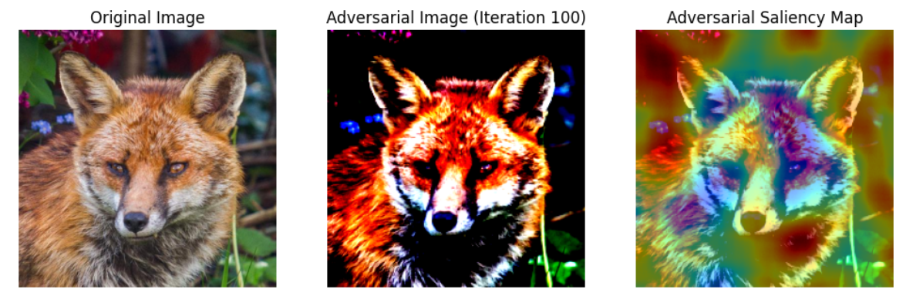

# Deep-Saliency: A Toolkit for Saliency Map Visualization and Adversarial Analysis

## Project Name: Visualizing and Comparing Saliency Maps in Adversarial Settings

### Overview

This project provides a deep learning-based toolkit for visualizing and comparing saliency maps in adversarial settings, utilizing advanced model interpretability techniques. By implementing methods such as RISE (Randomized Input Sampling for Explanation), Integrated Gradients, and Saliency Maps via the Captum library in PyTorch, the toolkit enables a detailed analysis of model behavior. Additionally, it generates adversarial attacks to examine their impact on model explanations, offering a comprehensive view of how models respond under adversarial conditions.

## Features

- **Model Interpretability**: Visualizes how different methods explain model predictions.
- **Adversarial Attacks**: Implements adversarial attacks to analyze model robustness.
- **RISE Saliency Maps**: Generates and visualizes saliency maps using the RISE technique.
- **Metrics and Comparisons**: Computes SSIM, MSE, and PSNR to compare original and adversarial saliency maps.
- **Custom Visualization**: Provides functions to visualize explanations using different colormaps.

## Usage

1. **Image Loading and Preprocessing**
    - Load images and preprocess them for input to the model.

2. **Generate Saliency Maps**
    - Use RISE and other interpretability techniques to generate saliency maps.
    
3. **Perform Adversarial Attacks**
    - Generate adversarial examples and visualize the impact on saliency maps.
    
4. **Compare Explanations**
    - Use various metrics to compare original and adversarial saliency maps.
    
## Examples

### 1. Explanation
Here is a comparison of the original image and the adversarial attack using RISE heatmap:



### 2. Explanation
Here is a comparison of the original image and the explanation heatmap:


### 3. Saliency Maps
This image shows the saliency map generated using the RISE method:


### 4. Adversarial Saliency Maps
This image illustrates the changes in the saliency map after an adversarial attack:


## Table of Contents

- [Setup](#setup)
- [Usage](#usage)
- [Key Components](#key-components)
- [Results](#results)
- [References](#references)

## Setup

### Prerequisites

- Python 3.x
- PyTorch
- Torchvision
- Keras
- PIL (Pillow)
- Scikit-Image
- Matplotlib
- Captum

### Installation

1. Clone the repository:
   ```bash
   git clone https://github.com/himanko/deep-saliency.git
   ```
2. Navigate to the project directory:
   ```bash
   cd deep-saliency
   ```
3. Install the required dependencies:
   ```bash
   pip install -r requirements.txt
   ```

## Usage

### 1. Loading and Preprocessing an Image

```python
from utils import load_img

model = Model().to(device)
img, x = load_img('path/to/image.jpg', model)
```

### 2. Generating RISE Saliency Maps

```python
from rise import generate_masks, explain

masks = generate_masks(N=2000, s=8, p1=0.5, input_size=model.input_size)
saliency_map = explain(model, x, masks, N=2000, batch_size=32, p1=0.5)
```

### 3. Performing an Adversarial Attack

```python
from adversarial_attack import perform_attack

x_adv, adv_expl = perform_attack(model, x, exp_method='integrated_gradients', num_iter=100)
```

### 4. Plotting Saliency Maps

```python
from visualization import plot_comparison

plot_comparison(original_image, org_expl, colormap='seismic', title_original='Original Image', title_explanation='Saliency Map')
```

### 5. Metrics for Comparison

```python
from metrics import compute_metrics

ssim, mse, psnr = compute_metrics(org_expl, adv_expl)
print(f"SSIM: {ssim}, MSE: {mse}, PSNR: {psnr}")
```

## Key Components

### 1. Model

Defines the `Model` class, which wraps around the ResNet50 architecture and includes methods for forwarding pass and image classification.

```python
class Model(nn.Module):
    def __init__(self):
        ...
    
    def forward(self, x):
        ...

    def classify(self, x):
        ...
```

### 2. RISE

Generates and applies RISE masks to obtain saliency maps.

- `generate_masks(N, s, p1, input_size)`: Generates random masks for input perturbation.
- `explain(model, inp, masks, N, batch_size, p1)`: Applies the RISE algorithm to compute saliency maps.

### 3. Adversarial Attack

Implements an adversarial attack and compares the original and adversarial saliency maps.

- `perform_attack(model, x, exp_method, num_iter)`: Runs the adversarial attack and returns the adversarial example and its explanation.

### 4. Visualization

Utilities for plotting saliency maps and comparison between the original and adversarial settings.

- `plot_comparison(original_image, explanation, colormap, title_original, title_explanation)`: Plots the original image and its explanation side by side.

### 5. Metrics

Computes similarity metrics between the original and adversarial saliency maps.

- `compute_metrics(org_expl, adv_expl)`: Computes SSIM, MSE, and PSNR between saliency maps.

## Results

- **Saliency Maps**: Visualizations of saliency maps using RISE, Integrated Gradients, and Saliency techniques.
- **Adversarial Attacks**: Analysis of the effects of adversarial perturbations on model explanations.
- **Comparison Metrics**: Quantitative comparison between original and adversarial saliency maps using SSIM, MSE, and PSNR.

The following metrics are used to compare the original and adversarial saliency maps:

- **SSIM (Structural Similarity Index)**:
    - Original and Adversarial: `0.999`
    - Original and Target: `0.005`
    - Adversarial and Target: `0.005`

- **MSE (Mean Squared Error)**:
    - Original and Adversarial: `1.36e-20`
    - Original and Target: `2.14e-05`
    - Adversarial and Target: `2.14e-05`

- **PSNR (Peak Signal-to-Noise Ratio)**:
    - Original and Adversarial: `154.37`
    - Original and Target: `2.42`
    - Adversarial and Target: `2.42`

## References

- [Captum](https://captum.ai/)
- [RISE: Randomized Input Sampling for Explanation of Black-box Models](https://arxiv.org/abs/1806.07421)
- [Integrated Gradients: Axiomatic Attribution for Deep Networks](https://arxiv.org/abs/1703.01365)

## License

This project is licensed under the Apache License 2.0. See the `LICENSE` file for more details.

## Contact

For any questions or suggestions, feel free to reach out on [LinkedIn](https://www.linkedin.com/in/himankoboruah/).


